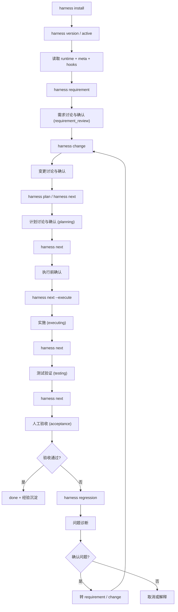
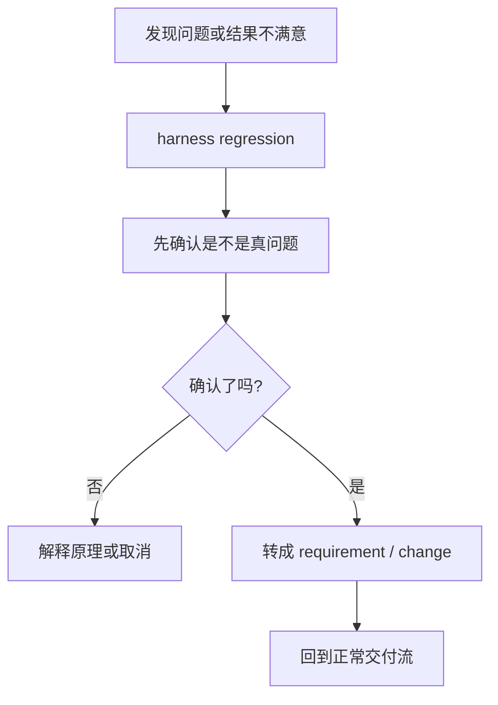
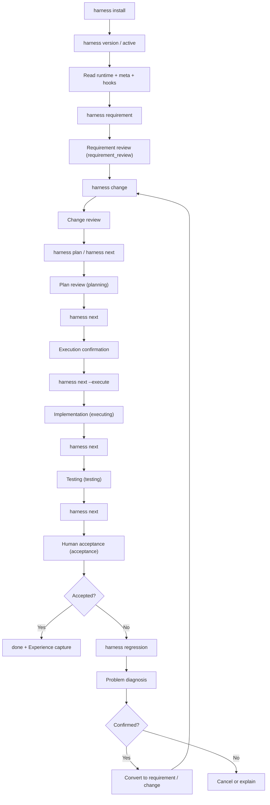
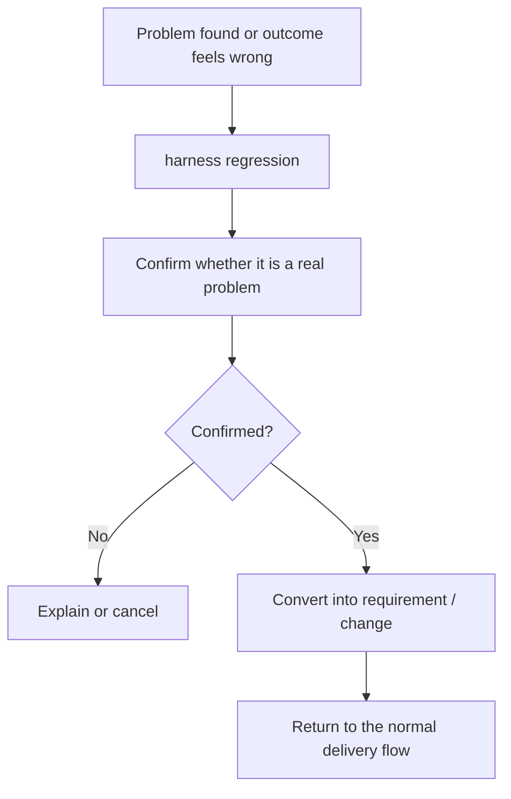

# harness-workflow

## 中文

`harness-workflow` 是一个面向 Codex、Claude Code、Qoder 的 Harness Engineering 工作流脚手架。

它的定位不是“再造一个 Agent”，而是给现有 Agent 提供一套统一的：

- 工作容器：`version -> requirement -> change -> plan -> execution`
- 状态路由：`workflow-runtime.yaml + version meta.yaml`
- 生命周期门禁：`.workflow/context/hooks/`
- 人工确认点：需求、变更、计划、执行前都必须显式停住

README 只负责两件事：

1. 告诉你这套东西为什么存在、怎么开始用
2. 告诉你详细规则去哪里看

详细硬规则不在这里展开，统一放到仓库里的 `rules` 和 `hooks`。

### 核心理念

- 工作流优先：先建 requirement / change / plan，再实施
- 状态优先：Agent 先读运行态，再决定动作
- Hook 优先：所有硬门禁按调用时机组织，避免规则散落
- 人工审核优先：需求、变更、计划、执行前都必须停下来等确认
- 经验复用优先：执行前索引经验，执行后沉淀经验

### 安装

推荐使用 `pipx`：

```bash
pipx install git+https://github.com/togally/harness-workflow.git
```

如果要强制覆盖旧安装：

```bash
pipx install --force git+https://github.com/togally/harness-workflow.git
```

也可以使用 `pip`：

```bash
pip install git+https://github.com/togally/harness-workflow.git
```

### 初始化项目

在项目根目录执行：

```bash
harness install
```

这会完成：

- 安装 `.codex/skills/harness`
- 安装 `.claude/skills/harness`
- 安装 `.qoder/skills/harness`
- 生成 `.claude/commands/harness-*.md`
- 生成 `.qoder/commands/harness-*.md`
- 生成 `.qoder/rules/harness-workflow.md`
- 生成 `.codex/skills/harness-*`
- 初始化 `.workflow/` 工作流骨架
- 写入 `AGENTS.md`、`CLAUDE.md`

如果只想生成文档骨架：

```bash
harness init
```

### 快速开始

```bash
harness language english
harness version "v1.0.0"
harness requirement "在线健康服务"
harness change "在线问诊预约" --requirement "在线健康服务"
harness plan "在线问诊预约"
harness next
harness next --execute
```

最常用的会话命令：

```bash
harness active "v1.0.0"
harness status
harness enter
harness exit
```

维护类命令：

```bash
harness regression "按钮交互动效不符合预期"
harness archive "在线健康服务"
harness rename requirement "在线健康服务" "无人机任务编排"
harness update
harness feedback
```

### 自进化机制

harness 内置两条进化线，让项目越用越聪明：

**应用项目线（经验沉淀）**

```text
session-memory.md → .workflow/context/experience/ → 正式 rules/
```

- Agent 被纠正、发现约束、路径失败、MCP 成功解决问题时自动记录
- 经验按命中次数升级置信度：`low`(新) → `medium`(3次+) → `high`(7次+)
- `high` 置信度 + 广泛适用 → 晋升为正式规则
- 90 天未命中标记 stale，再 90 天归档，不自动删除

**工具项目线（反馈回流）**

```text
.harness/feedback.jsonl → harness feedback → JSON → 工具仓库聚合 → 优化提案
```

- `ff`、`next`、`regression` 等命令自动记录结构事件
- `harness feedback` 导出统计摘要到当前目录，格式兼容 MCP / curl
- 工具仓库聚合多项目反馈后生成优化提案 → 人工确认 → 发版

### 三端入口 / Three-Platform Entry

harness 支持三个 AI 平台，通过 `harness install` 时交互式选择：

| 平台 | 配置文件 | 说明 |
|------|---------|------|
| Codex | `AGENTS.md` | Agent 协作文档 |
| Claude Code (cc) | `CLAUDE.md` + `.claude/commands/` | Claude Code 入口 |
| Qoder | `.qoder/skills/harness/SKILL.md` | Qoder skill 定义 |

**交互选择**：执行 `harness install` 时，会提示勾选需要支持的平台。未勾选的配置会移到 `.workflow/context/backup/` 备份。重新勾选时从备份恢复。

**非交互模式**：在脚本或 CI 环境中运行时，自动使用当前配置或默认全选。

- Codex：主入口是 `.codex/skills/harness`，命令级入口是 `.codex/skills/harness-*`
- Claude Code：主入口是 `.claude/skills/harness`，命令级入口是 `.claude/commands/harness-*.md`
- Qoder：主入口是 `.qoder/skills/harness`，命令级入口是 `.qoder/commands/harness-*.md`

命令调用约定：

- 优先使用全局 `harness` CLI
- 如果全局 CLI 不可用，再回退到项目内 skill 脚本
- 不要假设目标项目根目录存在 `scripts/harness.py`

### 核心概念

- `requirement`：需求讨论与确认
- `change`：需求拆分出的功能变更，也可以独立存在
- `plan`：具体执行计划
- `regression`：先确认是不是真问题，再决定是否转成 requirement / change
- `.workflow/state/runtime.yaml`：仓库级运行态
- `.workflow/flow/`：需求、变更、计划等工作文档区
- `.workflow/context/`：稳定规则、角色、经验、项目上下文

### 六层架构 / Six-Layer Architecture

```text
┌─────────────────────────────────────────────────────────────┐
│  Layer 6: 状态管理层 (State Management)                      │
│  runtime.yaml + meta.yaml + platforms.yaml                  │
├─────────────────────────────────────────────────────────────┤
│  Layer 5: 验收层 (Evaluation Layer)                          │
│  testing/ → acceptance/ → done                              │
├─────────────────────────────────────────────────────────────┤
│  Layer 4: 执行层 (Execution Layer)                           │
│  executing + session-memory.md                              │
├─────────────────────────────────────────────────────────────┤
│  Layer 3: 规划层 (Planning Layer)                            │
│  requirement_review → planning → change.md + plan.md        │
├─────────────────────────────────────────────────────────────┤
│  Layer 2: 上下文层 (Context Layer)                           │
│  .workflow/context/ (rules + hooks + experience + project)   │
├─────────────────────────────────────────────────────────────┤
│  Layer 1: 入口层 (Entry Layer)                               │
│  WORKFLOW.md + AGENTS.md + CLAUDE.md + SKILL.md             │
└─────────────────────────────────────────────────────────────┘
```

**层次说明：**

| 层级 | 名称 | 职责 |
|------|------|------|
| Layer 1 | 入口层 | 三端统一入口，路由到上下文层 |
| Layer 2 | 上下文层 | 项目规则、经验、约束的加载中心 |
| Layer 3 | 规划层 | 需求分析、变更拆分、计划制定 |
| Layer 4 | 执行层 | 代码实现、执行日志 |
| Layer 5 | 验收层 | 测试验证、人工验收 |
| Layer 6 | 状态管理层 | 运行时状态、版本元数据 |

### 推荐阅读入口

如果你是人：

1. `README.md`
2. `WORKFLOW.md`
3. `.workflow/context/index.md`

如果你是 Agent：

1. `AGENTS.md`
2. `WORKFLOW.md`
3. `.workflow/context/index.md`
4. `.workflow/state/runtime.yaml`
5. 当前 stage 命中的角色 / 经验 / 约束文件

### 规则放在哪里

README 不再展开详细硬规则，统一从这些文件进入：

- `AGENTS.md`
- `CLAUDE.md`
- `WORKFLOW.md`
- `.workflow/context/index.md`
- `.workflow/state/runtime.yaml`
- `.workflow/context/roles/<stage>.md`
- `.workflow/context/experience/...`
- `.workflow/constraints/*.md`
- `.workflow/flow/stages.md`

### 目录结构

```text
.workflow/
├── context/
│   ├── roles/              # stage 对应角色
│   ├── experience/         # 经验索引与条目
│   ├── project/
│   ├── team/
│   └── index.md
├── constraints/
├── evaluation/
├── flow/
│   ├── requirements/
│   └── archive/            # 首次 archive 时按需创建
└── state/
    ├── runtime.yaml
    ├── requirements/
    ├── sessions/
    └── platforms.yaml
.harness/
└── feedback.jsonl           # 使用事件静默记录
```

### 升级已有项目

先升级本机 CLI：

```bash
pipx upgrade harness-workflow
```

或者：

```bash
pipx install --force git+https://github.com/togally/harness-workflow.git
```

然后进入项目执行：

```bash
harness update
```

预览变更：

```bash
harness update --check
```

强制覆盖受管文件：

```bash
harness update --force-managed
```

### 中文流程图

#### 完整交付流



#### 回归流



---

## English

`harness-workflow` is a Harness Engineering workflow scaffold for Codex, Claude Code, and Qoder.

Its role is not to replace agents. It gives agents a shared structure for:

- work containers: `version -> requirement -> change -> plan -> execution`
- state routing: `workflow-runtime.yaml + version meta.yaml`
- lifecycle gates: `.workflow/context/hooks/`
- explicit human approval points

This README is intentionally limited to:

1. what the workflow is
2. how to start using it
3. where to find detailed rules

Detailed gates and hard rules live in `rules` and `hooks`, not here.

### Philosophy

- workflow first
- state before action
- hooks before improvisation
- human approval before stage advance
- experience reuse before repeated mistakes

### Install

```bash
pipx install git+https://github.com/togally/harness-workflow.git
```

Force reinstall:

```bash
pipx install --force git+https://github.com/togally/harness-workflow.git
```

or:

```bash
pip install git+https://github.com/togally/harness-workflow.git
```

### Initialize a Repository

```bash
harness install
```

This installs:

- `.codex/skills/harness`
- `.claude/skills/harness`
- `.qoder/skills/harness`
- command entrypoints for Claude Code and Qoder
- thin command wrappers for Codex
- `AGENTS.md`
- `CLAUDE.md`
- the `.workflow/` workflow structure

If you only want the docs skeleton:

```bash
harness init
```

### Quick Start

```bash
harness language english
harness version "v1.0.0"
harness requirement "Online Health Service"
harness change "Online Booking" --requirement "online-health-service"
harness plan "Online Booking"
harness next
harness next --execute
```

Common routing commands:

```bash
harness active "v1.0.0"
harness status
harness enter
harness exit
```

Maintenance commands:

```bash
harness regression "Button interaction feels wrong"
harness archive "Online Health Service"
harness rename requirement "Online Health Service" "Customer Health Service"
harness update
harness feedback
```

### Self-Evolution

harness has two built-in evolution lines that make projects smarter over time:

**Application project line (experience accumulation)**

```text
session-memory.md → .workflow/context/experience/ → formal rules/
```

- Lessons captured when the agent is corrected, constraints discovered, paths fail, or MCPs solve problems
- Confidence upgrades by hit count: `low`(new) → `medium`(3+) → `high`(7+)
- `high` confidence + broadly applicable → promoted to formal rule
- 90 days without a hit marks stale, another 90 days archives; never auto-deleted

**Tool project line (feedback loop)**

```text
.harness/feedback.jsonl → harness feedback → JSON → tool repo aggregation → optimization proposals
```

- `ff`, `next`, `regression` commands silently record structural events
- `harness feedback` exports a summary to the current directory, compatible with MCP / curl
- Tool repo aggregates multi-project feedback → proposals → human approval → release

### Tool Entry Points

- Codex: `.codex/skills/harness` and `.codex/skills/harness-*`
- Claude Code: `.claude/skills/harness` and `.claude/commands/harness-*.md`
- Qoder: `.qoder/skills/harness` and `.qoder/commands/harness-*.md`

Resolution order:

- prefer the global `harness` CLI
- fall back to the project-local harness skill script only when needed
- never assume a root-level `scripts/harness.py` exists in the target repository

### Core Concepts

- `version`: main work container
- `requirement`: requirement review and approval
- `change`: feature split from a requirement, or a standalone change
- `plan`: executable implementation plan
- `regression`: diagnose first, then convert into requirement/change if confirmed
- `workflow-runtime.yaml`: repository-level runtime state
- `meta.yaml`: version-local state
- `hooks/`: hard gates organized by invocation timing

### Six-Layer Architecture

```text
┌─────────────────────────────────────────────────────────────┐
│  Layer 6: State Management                                  │
│  runtime.yaml + meta.yaml + platforms.yaml                  │
├─────────────────────────────────────────────────────────────┤
│  Layer 5: Evaluation Layer                                  │
│  testing/ → acceptance/ → done                              │
├─────────────────────────────────────────────────────────────┤
│  Layer 4: Execution Layer                                   │
│  executing + session-memory.md                              │
├─────────────────────────────────────────────────────────────┤
│  Layer 3: Planning Layer                                    │
│  requirement_review → planning → change.md + plan.md        │
├─────────────────────────────────────────────────────────────┤
│  Layer 2: Context Layer                                     │
│  .workflow/context/ (rules + hooks + experience + project)   │
├─────────────────────────────────────────────────────────────┤
│  Layer 1: Entry Layer                                       │
│  WORKFLOW.md + AGENTS.md + CLAUDE.md + SKILL.md             │
└─────────────────────────────────────────────────────────────┘
```

**Layer Description:**

| Layer | Name | Responsibility |
|-------|------|----------------|
| Layer 1 | Entry Layer | Unified entry for three platforms, routes to context |
| Layer 2 | Context Layer | Project rules, experience, constraints loading center |
| Layer 3 | Planning Layer | Requirement analysis, change split, plan creation |
| Layer 4 | Execution Layer | Code implementation, execution log |
| Layer 5 | Evaluation Layer | Testing verification, human acceptance |
| Layer 6 | State Management | Runtime state, version metadata |

### Three-Platform Entry

harness supports three AI platforms with interactive selection during `harness install`:

| Platform | Config File | Description |
|----------|-------------|-------------|
| Codex | `AGENTS.md` | Agent collaboration doc |
| Claude Code (cc) | `CLAUDE.md` + `.claude/commands/` | Claude Code entry |
| Qoder | `.qoder/skills/harness/SKILL.md` | Qoder skill definition |

**Interactive Selection**: Running `harness install` prompts you to select platforms. Unselected configs are backed up to `.workflow/context/backup/`. Re-selecting restores from backup.

**Non-interactive Mode**: In scripts or CI environments, uses current config or defaults to all platforms.

- Codex: `.codex/skills/harness` and `.codex/skills/harness-*`
- Claude Code: `.claude/skills/harness` and `.claude/commands/harness-*.md`
- Qoder: `.qoder/skills/harness` and `.qoder/commands/harness-*.md`

### Where To Read Next

For humans:

1. `README.md`
2. `WORKFLOW.md`
3. `.workflow/context/index.md`

For agents:

1. `AGENTS.md`
2. `WORKFLOW.md`
3. `.workflow/context/index.md`
4. `.workflow/state/runtime.yaml`
5. the matched role / experience / constraint files

### Where Detailed Rules Live

- `AGENTS.md`
- `CLAUDE.md`
- `WORKFLOW.md`
- `.workflow/context/index.md`
- `.workflow/state/runtime.yaml`
- `.workflow/context/roles/<stage>.md`
- `.workflow/context/experience/...`
- `.workflow/constraints/*.md`
- `.workflow/flow/stages.md`

### Repository Structure

```text
.workflow/
├── context/
│   ├── roles/              # stage-specific roles
│   ├── experience/         # experience index and entries
│   ├── project/
│   ├── team/
│   └── index.md
├── constraints/
├── evaluation/
├── flow/
│   ├── requirements/
│   └── archive/            # created on demand when archiving
└── state/
    ├── runtime.yaml
    ├── requirements/
    ├── sessions/
    └── platforms.yaml
.harness/
└── feedback.jsonl           # silent usage event log
```

### Upgrade an Existing Repository

Upgrade the local CLI first:

```bash
pipx upgrade harness-workflow
```

or:

```bash
pipx install --force git+https://github.com/togally/harness-workflow.git
```

Then update the repository:

```bash
harness update
```

Preview changes:

```bash
harness update --check
```

Force managed file refresh:

```bash
harness update --force-managed
```

### English Flow

#### Complete Delivery Flow



#### Regression Flow


