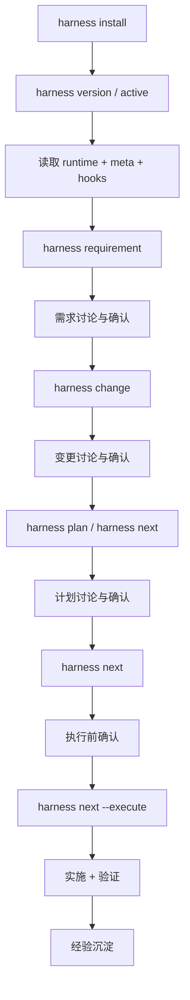
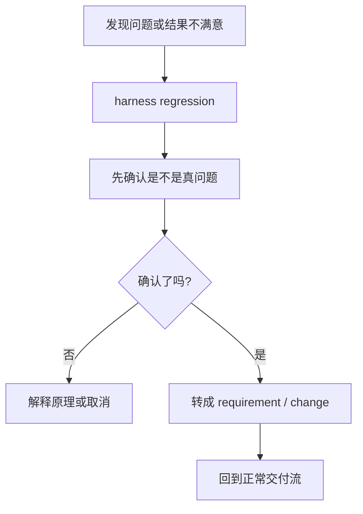
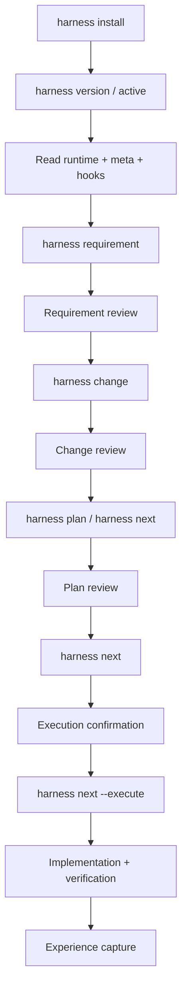
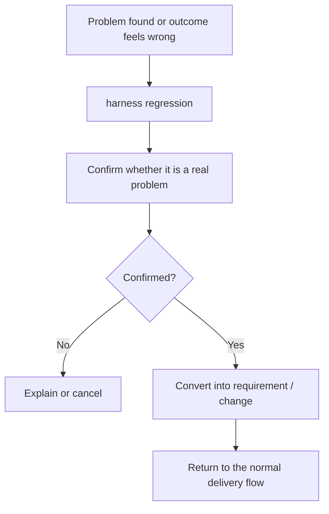

# harness-workflow

## 中文

`harness-workflow` 是一个面向 Codex、Claude Code、Qoder 的 Harness Engineering 工作流脚手架。

它的定位不是“再造一个 Agent”，而是给现有 Agent 提供一套统一的：

- 工作容器：`version -> requirement -> change -> plan -> execution`
- 状态路由：`workflow-runtime.yaml + version meta.yaml`
- 生命周期门禁：`docs/context/hooks/`
- 人工确认点：需求、变更、计划、执行前都必须显式停住

README 只负责两件事：

1. 告诉你这套东西为什么存在、怎么开始用
2. 告诉你详细规则去哪里看

详细硬规则不在这里展开，统一放到仓库里的 `rules` 和 `hooks`。

### 核心理念

- 工作流优先：先建 requirement / change / plan，再实施
- 状态优先：Agent 先读运行态，再决定动作
- Hook 优先：所有硬门禁按调用时机组织，避免规则散落
- 人工审核优先：需求、变更、计划、执行前都必须停下来等确认
- 经验复用优先：执行前索引经验，执行后沉淀经验

### 安装

推荐使用 `pipx`：

```bash
pipx install git+https://github.com/togally/harness-workflow.git
```

如果要强制覆盖旧安装：

```bash
pipx install --force git+https://github.com/togally/harness-workflow.git
```

也可以使用 `pip`：

```bash
pip install git+https://github.com/togally/harness-workflow.git
```

### 初始化项目

在项目根目录执行：

```bash
harness install
```

这会完成：

- 安装 `.codex/skills/harness`
- 安装 `.claude/skills/harness`
- 安装 `.qoder/skills/harness`
- 生成 `.claude/commands/harness-*.md`
- 生成 `.qoder/commands/harness-*.md`
- 生成 `.qoder/rules/harness-workflow.md`
- 生成 `.codex/skills/harness-*`
- 初始化 `docs/` 工作流骨架
- 写入 `AGENTS.md`、`CLAUDE.md`

如果只想生成文档骨架：

```bash
harness init
```

### 快速开始

```bash
harness language english
harness version "v1.0.0"
harness requirement "在线健康服务"
harness change "在线问诊预约" --requirement "在线健康服务"
harness plan "在线问诊预约"
harness next
harness next --execute
```

最常用的会话命令：

```bash
harness active "v1.0.0"
harness status
harness enter
harness exit
```

维护类命令：

```bash
harness regression "按钮交互动效不符合预期"
harness archive "在线健康服务"
harness rename requirement "在线健康服务" "无人机任务编排"
harness update
```

### 三端入口

- Codex：主入口是 `.codex/skills/harness`，命令级入口是 `.codex/skills/harness-*`
- Claude Code：主入口是 `.claude/skills/harness`，命令级入口是 `.claude/commands/harness-*.md`
- Qoder：主入口是 `.qoder/skills/harness`，命令级入口是 `.qoder/commands/harness-*.md`

命令调用约定：

- 优先使用全局 `harness` CLI
- 如果全局 CLI 不可用，再回退到项目内 skill 脚本
- 不要假设目标项目根目录存在 `scripts/harness.py`

### 核心概念

- `version`：主工作容器
- `requirement`：需求讨论与确认
- `change`：需求拆分出的功能变更，也可以独立存在
- `plan`：具体执行计划
- `regression`：先确认是不是真问题，再决定是否转成 requirement / change
- `workflow-runtime.yaml`：仓库级运行态
- `meta.yaml`：当前 version 的局部状态
- `hooks/`：按调用时机组织的硬门禁

### 推荐阅读入口

如果你是人：

1. `README.md`
2. `docs/README.md`
3. `docs/context/rules/development-flow.md`

如果你是 Agent：

1. `AGENTS.md`
2. `docs/context/rules/workflow-runtime.yaml`
3. 当前 version 的 `meta.yaml`
4. `docs/context/hooks/README.md`
5. 命中的 hook 文档

### 规则放在哪里

README 不再展开详细硬规则，统一从这些文件进入：

- `AGENTS.md`
- `CLAUDE.md`
- `docs/README.md`
- `docs/context/rules/development-flow.md`
- `docs/context/rules/agent-workflow.md`
- `docs/context/rules/workflow-runtime.yaml`
- `docs/context/hooks/README.md`
- `docs/context/hooks/<timing>.md`
- `docs/versions/active/<version>/meta.yaml`

### 目录结构

```text
docs/
├── context/
│   ├── hooks/
│   ├── experience/
│   ├── project/
│   ├── team/
│   └── rules/
├── memory/
├── versions/
│   ├── active/
│   │   └── <version>/
│   │       ├── requirements/ 或 需求/
│   │       ├── changes/ 或 变更/
│   │       ├── regressions/ 或 回归/
│   │       ├── archive/ 或 归档/
│   │       └── meta.yaml
│   └── archive/
├── templates/
├── decisions/
└── runbooks/
```

### 升级已有项目

先升级本机 CLI：

```bash
pipx upgrade harness-workflow
```

或者：

```bash
pipx install --force git+https://github.com/togally/harness-workflow.git
```

然后进入项目执行：

```bash
harness update
```

预览变更：

```bash
harness update --check
```

强制覆盖受管文件：

```bash
harness update --force-managed
```

### 中文流程图

#### 正常交付流



#### 回归流



---

## English

`harness-workflow` is a Harness Engineering workflow scaffold for Codex, Claude Code, and Qoder.

Its role is not to replace agents. It gives agents a shared structure for:

- work containers: `version -> requirement -> change -> plan -> execution`
- state routing: `workflow-runtime.yaml + version meta.yaml`
- lifecycle gates: `docs/context/hooks/`
- explicit human approval points

This README is intentionally limited to:

1. what the workflow is
2. how to start using it
3. where to find detailed rules

Detailed gates and hard rules live in `rules` and `hooks`, not here.

### Philosophy

- workflow first
- state before action
- hooks before improvisation
- human approval before stage advance
- experience reuse before repeated mistakes

### Install

```bash
pipx install git+https://github.com/togally/harness-workflow.git
```

Force reinstall:

```bash
pipx install --force git+https://github.com/togally/harness-workflow.git
```

or:

```bash
pip install git+https://github.com/togally/harness-workflow.git
```

### Initialize a Repository

```bash
harness install
```

This installs:

- `.codex/skills/harness`
- `.claude/skills/harness`
- `.qoder/skills/harness`
- command entrypoints for Claude Code and Qoder
- thin command wrappers for Codex
- `AGENTS.md`
- `CLAUDE.md`
- the `docs/` workflow structure

If you only want the docs skeleton:

```bash
harness init
```

### Quick Start

```bash
harness language english
harness version "v1.0.0"
harness requirement "Online Health Service"
harness change "Online Booking" --requirement "online-health-service"
harness plan "Online Booking"
harness next
harness next --execute
```

Common routing commands:

```bash
harness active "v1.0.0"
harness status
harness enter
harness exit
```

Maintenance commands:

```bash
harness regression "Button interaction feels wrong"
harness archive "Online Health Service"
harness rename requirement "Online Health Service" "Customer Health Service"
harness update
```

### Tool Entry Points

- Codex: `.codex/skills/harness` and `.codex/skills/harness-*`
- Claude Code: `.claude/skills/harness` and `.claude/commands/harness-*.md`
- Qoder: `.qoder/skills/harness` and `.qoder/commands/harness-*.md`

Resolution order:

- prefer the global `harness` CLI
- fall back to the project-local harness skill script only when needed
- never assume a root-level `scripts/harness.py` exists in the target repository

### Core Concepts

- `version`: main work container
- `requirement`: requirement review and approval
- `change`: feature split from a requirement, or a standalone change
- `plan`: executable implementation plan
- `regression`: diagnose first, then convert into requirement/change if confirmed
- `workflow-runtime.yaml`: repository-level runtime state
- `meta.yaml`: version-local state
- `hooks/`: hard gates organized by invocation timing

### Where To Read Next

For humans:

1. `README.md`
2. `docs/README.md`
3. `docs/context/rules/development-flow.md`

For agents:

1. `AGENTS.md`
2. `docs/context/rules/workflow-runtime.yaml`
3. the current version `meta.yaml`
4. `docs/context/hooks/README.md`
5. matched hook files

### Where Detailed Rules Live

- `AGENTS.md`
- `CLAUDE.md`
- `docs/README.md`
- `docs/context/rules/development-flow.md`
- `docs/context/rules/agent-workflow.md`
- `docs/context/rules/workflow-runtime.yaml`
- `docs/context/hooks/README.md`
- `docs/context/hooks/<timing>.md`
- `docs/versions/active/<version>/meta.yaml`

### Repository Structure

```text
docs/
├── context/
│   ├── hooks/
│   ├── experience/
│   ├── project/
│   ├── team/
│   └── rules/
├── memory/
├── versions/
│   ├── active/
│   │   └── <version>/
│   │       ├── requirements/
│   │       ├── changes/
│   │       ├── regressions/
│   │       ├── archive/
│   │       └── meta.yaml
│   └── archive/
├── templates/
├── decisions/
└── runbooks/
```

### Upgrade an Existing Repository

Upgrade the local CLI first:

```bash
pipx upgrade harness-workflow
```

or:

```bash
pipx install --force git+https://github.com/togally/harness-workflow.git
```

Then update the repository:

```bash
harness update
```

Preview changes:

```bash
harness update --check
```

Force managed file refresh:

```bash
harness update --force-managed
```

### English Flow

#### Delivery Flow



#### Regression Flow


