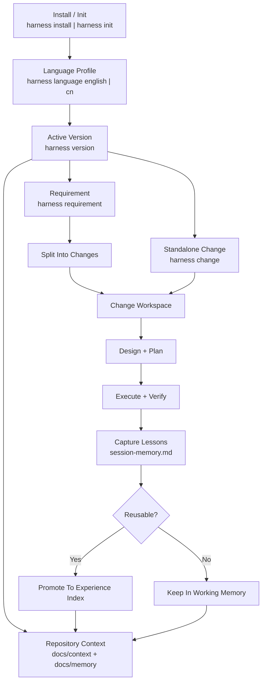

# harness-workflow

## 中文

`harness-workflow` 是一个面向 Codex / Claude Code 的 Harness Engineering 工作流仓库。

它现在提供 4 层能力：

- 全局 CLI：安装后可直接使用 `harness`
- 双端项目级 skill：`harness install` 会同时安装到 `.codex/skills/harness` 与 `.claude/skills/harness`
- 版本主容器工作流：`version` 是 requirement / change / plan 的主工作容器
- 项目级经验沉淀：通过 `session-memory.md`、`experience/index.md` 与规则文档持续累积知识

### 安装

推荐使用 `pipx`：

```bash
pipx install git+https://github.com/togally/harness-workflow.git
```

也可以使用 `pip`：

```bash
pip install git+https://github.com/togally/harness-workflow.git
```

### 初始化项目

在任意项目根目录执行：

```bash
harness install
```

这会默认完成：

- 安装 `.codex/skills/harness`
- 安装 `.claude/skills/harness`
- 生成 `AGENTS.md` 和 `CLAUDE.md`
- 初始化 `docs/` 结构
- 写入 `.codex/harness/config.json`
- 写入 `tools/lint_harness_repo.py`

如果只想初始化文档骨架：

```bash
harness init
```

### 日常命令

默认语言是 `english`，可以切换：

```bash
harness language cn
harness language english
```

推荐工作流：

```bash
harness version "v1.0.0"
harness requirement "在线健康服务"
harness change "在线问诊预约" --requirement "在线健康服务"
harness change "修复登录按钮样式"
harness plan "在线问诊预约"
```

要点：

- `version` 是主工作容器
- `requirement` 和 `change` 都创建在当前激活的 version 下
- `change` 可以独立存在，不要求必须挂 requirement
- `context/` 仍然是仓库级知识库，不归属某个 version

### 升级指南

升级分两步：

1. 升级你机器上的 CLI
2. 用新 CLI 同步当前项目

升级 CLI：

```bash
pipx upgrade harness-workflow
```

或：

```bash
pip install --upgrade git+https://github.com/togally/harness-workflow.git
```

同步项目：

```bash
harness update
```

预览更新内容：

```bash
harness update --check
```

强制覆盖受管文件：

```bash
harness update --force-managed
```

`harness update` 会：

- 刷新 `.codex/skills/harness`
- 刷新 `.claude/skills/harness`
- 根据当前语言配置同步受管模板与入口文件
- 跳过你已经修改过的受管文件，除非显式使用 `--force-managed`

### 业务流图



### 推荐结构

```text
docs/
├── context/
│   ├── team/
│   ├── project/
│   ├── experience/
│   └── rules/
├── memory/
├── versions/
│   ├── active/
│   │   └── v1.0.0/
│   │       ├── README.md
│   │       ├── version-memory.md / 版本记忆.md
│   │       ├── requirements/ 或 需求/
│   │       ├── changes/ 或 变更/
│   │       └── plans/ 或 计划/
│   └── archive/
├── decisions/
├── runbooks/
└── templates/
```

## English

`harness-workflow` is a Harness Engineering workflow for Codex and Claude Code repositories.

It provides:

- a global `harness` CLI
- project-local skills for both Codex and Claude Code
- a version-centered workspace model
- built-in lesson capture and repository memory

### Install

```bash
pipx install git+https://github.com/togally/harness-workflow.git
```

or:

```bash
pip install git+https://github.com/togally/harness-workflow.git
```

### Initialize A Repository

```bash
harness install
```

This installs:

- `.codex/skills/harness`
- `.claude/skills/harness`
- `AGENTS.md`
- `CLAUDE.md`
- the `docs/` workflow structure
- `.codex/harness/config.json`
- `tools/lint_harness_repo.py`

### Daily Workflow

Default language is `english`. Switch when needed:

```bash
harness language english
harness language cn
```

Recommended flow:

```bash
harness version "v1.0.0"
harness requirement "Online Health Service"
harness change "Online Booking" --requirement "online-health-service"
harness change "Quick Login UI Fix"
harness plan "Online Booking"
```

Key rules:

- `version` is the main work container
- requirements and changes live under the active version
- changes may exist without a requirement
- `docs/context/` stays repository-level and should not be version-scoped

### Upgrade

1. Upgrade the CLI
2. Sync the current repository

```bash
pipx upgrade harness-workflow
harness update
```

Preview only:

```bash
harness update --check
```

Force managed files:

```bash
harness update --force-managed
```

### Verify

```bash
python3 tools/lint_harness_repo.py --root . --strict-agents --strict-claude
```
