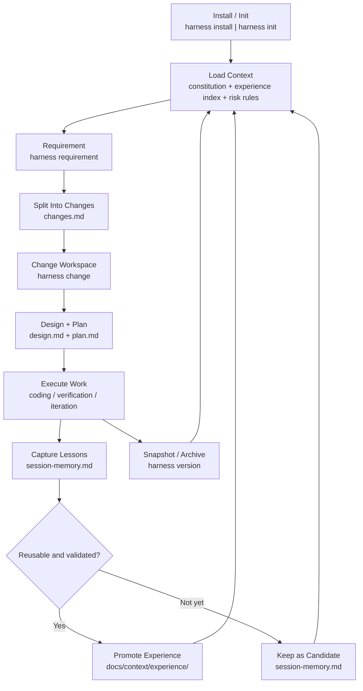

# harness-workflow

`harness-workflow` 是一个面向 Codex / Claude Code 的 Harness Engineering 工作流仓库。

它提供两层能力：

- 全局 CLI：安装后可直接使用 `harness`
- 本地 skill：执行 `harness install` 后，会把 `harness` skill 同时安装到 Codex 与 Claude Code 的项目级目录，并写入根入口文件和 `docs/` 工作流骨架
- 项目内经验沉淀：默认提供 `session-memory`、`experience/index` 与规则文档，让项目在开发过程中持续积累经验

## 安装

推荐使用 `pipx`：

```bash
pipx install git+https://github.com/togally/harness-workflow.git
```

也可以直接用 `pip`：

```bash
pip install git+https://github.com/togally/harness-workflow.git
```

## 在项目中初始化

进入任意项目根目录后执行：

```bash
harness install
```

这会默认完成：

- 安装项目级 `/.codex/skills/harness`
- 安装项目级 `/.claude/skills/harness`
- 生成 `AGENTS.md` 和 `CLAUDE.md`（仅在缺失时创建）
- 初始化 `docs/` 下的 harness 工作流目录
- 写入 `tools/lint_harness_repo.py`

如果你只想初始化文档骨架，也可以执行：

```bash
harness init
```

## 升级指南

`harness` 的升级分成两步，这两步解决的是不同问题：

1. 升级你机器上的 CLI 包
2. 用新的 CLI 同步当前项目里的本地 skill 和受管文档

### 1. 升级 CLI

如果你是用 `pipx` 安装的，推荐执行：

```bash
pipx upgrade harness-workflow
```

如果你是直接从 GitHub 安装的，也可以重新安装：

```bash
pipx install --force git+https://github.com/togally/harness-workflow.git
```

或使用 `pip`：

```bash
pip install --upgrade git+https://github.com/togally/harness-workflow.git
```

### 2. 升级当前项目

进入项目根目录后执行：

```bash
harness update
```

这会默认执行两类同步：

- 刷新 `.codex/skills/harness`，让 Codex 项目级 skill 跟随当前已安装的 CLI 版本
- 刷新 `.claude/skills/harness`，让 Claude Code 项目级 skill 跟随当前已安装的 CLI 版本
- 同步 `docs/`、`AGENTS.md`、`CLAUDE.md`、`tools/lint_harness_repo.py` 等受管文件

### 检查将发生什么

如果你想先看哪些文件会更新，不立即落盘：

```bash
harness update --check
```

### 安全更新策略

`harness update` 会把受管文件分成三类：

- `current`：当前文件已经是最新内容，不改
- `missing`：文件缺失，会自动补齐
- `skipped modified`：文件被本地修改过，默认跳过，避免覆盖项目定制

同时，`harness` 会在 `.codex/harness/managed-files.json` 里维护一份受管文件状态，用来判断哪些文件可以安全升级。

### 强制覆盖受管文件

如果你确认要用最新模板覆盖本地改动：

```bash
harness update --force-managed
```

这适合：

- 旧项目想整体迁移到新的 harness 模板
- 你确认本地改动不需要保留
- 你希望把新的经验沉淀机制整体补进旧项目

### 新项目与旧项目的区别

- 新项目：`harness install` 后天然具备最新 skill、模板和经验沉淀能力
- 旧项目：先升级 CLI，再执行 `harness update`
- 如果旧项目曾深度定制 `CLAUDE.md`、`AGENTS.md` 或 `docs/context/`，建议先运行 `harness update --check`

## 日常工作流

```bash
harness requirement --id pet-health --title "在线健康服务"
harness change --id pet-health-booking --title "在线问诊预约" --requirement pet-health
harness plan --change pet-health-booking
harness version --id v1.0.0
```

## 业务流图

下面这张图描述了 `harness` 在项目里的主业务闭环：



这个闭环有两个重点：

- 主交付流：`requirement -> change -> plan -> execute -> version`
- 经验复利流：`execute -> session-memory -> experience -> 下一次加载上下文`

## 目录约定

安装后项目会拥有以下核心结构：

```text
docs/
├── context/
├── memory/
├── requirements/
├── changes/
├── plans/
├── versions/
└── templates/
```

同时会生成：

- `AGENTS.md`
- `CLAUDE.md`
- `.codex/skills/harness/`
- `.claude/skills/harness/`
- `.codex/harness/managed-files.json`

## 验证

```bash
python3 tools/lint_harness_repo.py --root . --strict-agents --strict-claude
```
