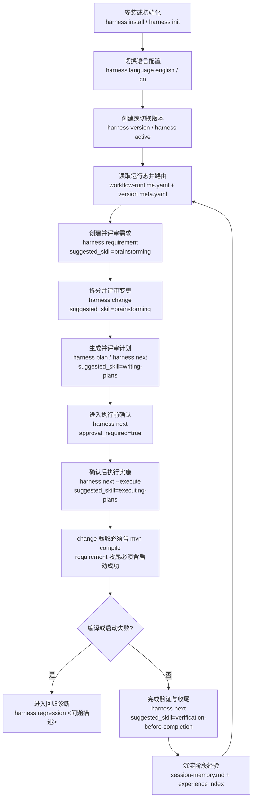
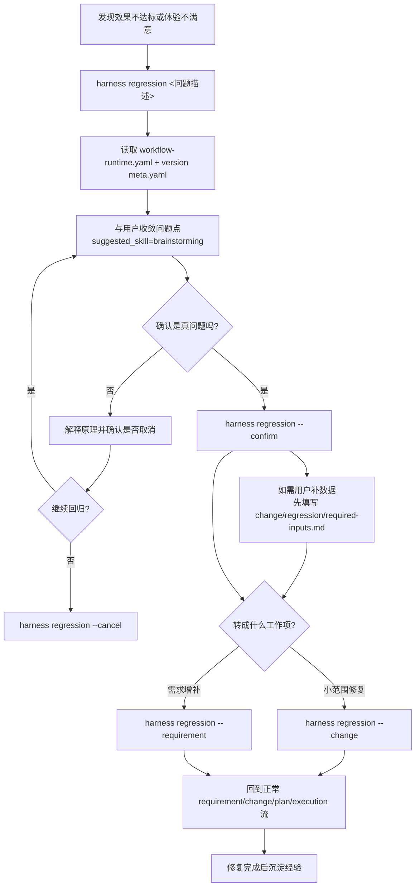
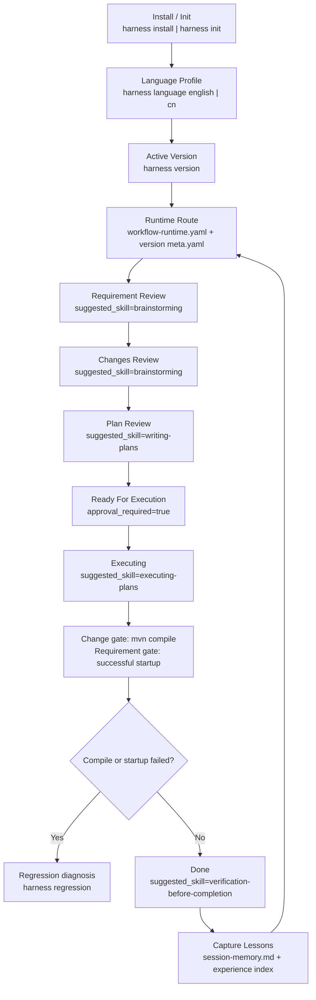
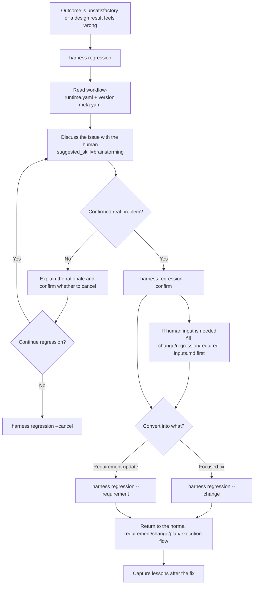

# harness-workflow

## 中文

`harness-workflow` 是一个面向 Codex / Claude Code 的 Harness Engineering 工作流仓库。

它现在提供 4 层能力：

- 全局 CLI：安装后可直接使用 `harness`
- 双端项目级 skill：`harness install` 会同时安装到 `.codex/skills/harness` 与 `.claude/skills/harness`
- 版本主容器工作流：`version` 是 requirement / change / plan 的主工作容器
- 规则驱动的协作流：通过 `workflow-runtime.yaml`、version `meta.yaml`、`development-flow.md` 与规则文档驱动 requirement/change/plan/execution 协作

### 安装

推荐使用 `pipx`：

```bash
pipx install git+https://github.com/togally/harness-workflow.git
```

如果要强制覆盖本机旧安装：

```bash
pipx install --force git+https://github.com/togally/harness-workflow.git
```

也可以使用 `pip`：

```bash
pip install git+https://github.com/togally/harness-workflow.git
```

### 初始化项目

在任意项目根目录执行：

```bash
harness install
```

这会默认完成：

- 安装 `.codex/skills/harness`
- 安装 `.claude/skills/harness`
- 生成 `AGENTS.md` 和 `CLAUDE.md`
- 初始化 `docs/` 结构
- 写入 `.codex/harness/config.json`
- 写入 `tools/lint_harness_repo.py`

如果只想初始化文档骨架：

```bash
harness init
```

### 日常命令

默认语言是 `english`，可以切换：

```bash
harness language cn
harness language english
```

推荐工作流：

```bash
harness version "v1.0.0"
harness requirement "在线健康服务"
harness change "在线问诊预约" --requirement "在线健康服务"
harness change "修复登录按钮样式"
harness plan "在线问诊预约"
harness rename requirement "在线健康服务" "无人机任务编排"
harness archive "无人机任务编排"
harness active "v1.0.0"
harness regression "按钮交互动效不符合预期"
harness regression --confirm
harness regression --change "优化按钮交互反馈"
harness status
harness next
harness ff
harness next --execute
```

命令入口约定：

- 优先使用全局 `harness` CLI
- 如果全局 CLI 不可用，再回退到 `.codex/skills/harness/scripts/harness.py` 或 `.claude/skills/harness/scripts/harness.py`
- 不要假设目标项目根目录存在 `scripts/harness.py`

要点：

- `version` 是主工作容器
- `requirement` 和 `change` 都创建在当前激活的 version 下
- `change` 可以独立存在，不要求必须挂 requirement
- `context/` 仍然是仓库级知识库，不归属某个 version
- `harness active "<version>"` 用于显式修复或切换当前活动 version
- `harness rename` 用于正式重命名 version / requirement / change，并同步元数据与主要引用
- `harness archive` 用于把某个已完成 requirement 及其 linked changes 归档到当前 version 的归档目录中
- `harness regression` 用于启动“先确认是不是真问题”的回归诊断流，确认后再转成新的 requirement 或 change
- 每个 change 完成前必须执行并记录 `mvn compile`
- 每个 requirement 完成前必须执行并记录项目启动测试成功
- 如果编译失败或启动失败，必须先进入 regression；如果需要用户补数据，先填写对应 change 的 `regression/required-inputs.md`
- 本机可直接获取的调试信息必须先由 AI 自行采集和分析，例如启动日志、编译输出、测试报错；不要先让用户代看本机日志

开始任何 requirement、change、plan 或执行前，先做这一步：

1. 读取 `docs/context/rules/workflow-runtime.yaml`
2. 找到 `current_version`
3. 读取该 version 的 `meta.yaml`
4. 确认当前 `stage`、`current_task`、`next_action`
5. 索引 `docs/context/experience/index.md`，加载与当前任务最相关的成熟经验
6. 如果 `suggested_skill` 非空，优先按它组织协作

如果出现以下任一情况，必须立即停止，不允许绕过工作流继续推进：

- `current_version` 缺失
- `workflow-runtime.yaml` 与 config 中的活动 version 不一致
- 当前 version 的 `meta.yaml` 缺失
- 流程卡住，无法确认当前阶段或下一步

此时应先修复状态，再继续工作。优先动作是：

- `harness active "<version>"`
- 或请用户修复/重建缺失的 workflow 文件

### 规则驱动协作流

`harness` 当前不是直接替你调用 superpowers，而是把“现在该用哪个 skill、该做什么、是否要停下来审核”写进 version 状态。
另外有一条默认经验规则：每个阶段开始执行具体任务前，都先索引经验；每个阶段完成后，都要检查是否有经验值得沉淀，成熟经验应主动融合进当前 requirement/change/plan/execution。

关键文件：

- `docs/context/rules/development-flow.md`
- `docs/context/rules/workflow-runtime.yaml`
- `docs/versions/active/<version>/meta.yaml`

其中 version `meta.yaml` 会记录：

- `stage`
- `current_task`
- `next_action`
- `suggested_skill`
- `assistant_prompt`
- `approval_required`

当前阶段与建议 skill 的默认映射：

- `requirement_review` -> `brainstorming`
- `changes_review` -> `brainstorming`
- `plan_review` -> `writing-plans`
- `ready_for_execution` -> 等待人工确认，不自动执行
- `executing` -> `executing-plans`
- `done` -> `verification-before-completion`

命令职责：

- `harness use "<version>"`：切换当前 version
- `harness active "<version>"`：显式设置当前活动 version，修复 runtime/config 路由
- `harness rename version|requirement|change "<old>" "<new>"`：正式改名并同步元数据与主要引用
- `harness archive "<requirement>"`：将某个 requirement 及其 linked changes 归档到当前 version 的 `archive/` 或 `归档/`
- `harness regression "<问题描述>"`：启动回归确认流
- `harness regression --confirm|--reject|--cancel`：推进当前回归诊断
- `harness regression --change "<标题>"`：将已确认问题转成新的 change
- `harness regression --requirement "<标题>"`：将已确认问题转成新的 requirement 增补
- `harness status`：查看当前运行态与建议 skill
- `harness next`：按当前状态推进下一步
- `harness ff`：跳过中间讨论阶段，直接到执行前确认
- `harness next --execute`：在 `ready_for_execution` 阶段确认执行

### 回归流程

当智能体已经完成开发和验证，但效果仍不达标、设计体验不满意、或者用户怀疑某个实现方向有问题时，不要直接返工。先进入回归诊断流：

- `harness regression "<问题描述>"`：创建回归工作区，进入问题确认阶段
- 先和用户收敛“不满意点”与预期行为，再判断是否是真问题
- 如果不是问题，解释原理并继续确认是否取消回归
- 如果确认是问题，再用 `harness regression --change "<标题>"` 或 `--requirement "<标题>"` 把它转成正式工作项
- 转换完成后，重新进入正常的 requirement/change/plan/execution 流程
- 修复完成后，继续按阶段规则沉淀经验
- regression 的长期留存放在 `docs/versions/active/<version>/regressions/` 目录和对应文档中，不长期占用 version 主状态

### 编译与启动门禁

- 每个 change 完成后的验收必须包含一次 `mvn compile`
- 每个 requirement 完成后的收尾必须包含项目启动测试成功
- 默认落点：
  - change：`acceptance.md`
  - requirement：`completion.md`
- 如果 `mvn compile` 失败或项目启动失败，不允许绕过工作流继续收尾，必须先进入 `harness regression "<问题描述>"`
- 如果继续修复前需要用户补充配置、测试数据、账号或外部依赖信息，必须先填写对应 change 的 `regression/required-inputs.md`，再提示用户补充；不要跳过模板直接在对话里临时发问
- 本机能够直接采集的启动日志、编译输出、测试失败堆栈，应先由 AI 自己运行并读取；只有确实缺少外部输入时才需要用户填写模板

### 归档与改名维护

推荐优先使用正式命令：

```bash
harness rename version "v1.0.0" "release-1"
harness rename requirement "online-health-service" "customer-health-service"
harness rename change "online-booking" "customer-booking"
harness archive "customer-health-service"
```

归档规则：

- 归档是 version 内部行为，不是把整个 version 挪到 `docs/versions/archive/`
- 归档后结构会变成 `当前 version/archive/<requirement>/changes/<change>/...`
- requirement 原目录会被清理
- 与该 requirement 关联的 change 及其 `plan.md`、`design.md`、`acceptance.md`、`session-memory.md` 会一起移入归档目录
- version `meta.yaml` 里的 `requirement_ids`、`change_ids` 和当前焦点状态会同步清理

改名维护规则：

- 想完整改名时，优先用 `harness rename`
- 如果你手动改了 version / requirement / change 文件夹名，再执行 `harness update`
- 如果你删除了 version / requirement / change，再执行 `harness update`
- `harness update` 会尽量修复：
  - version `meta.yaml`
  - requirement / change `meta.yaml`
  - runtime/config 中的当前 version 路由
  - change 对 requirement 的元数据引用
- `harness update` 也会在删除后回退状态：
  - 当前 version 被删时，回退到仍然存在的活动 version
  - 当前 requirement / change / plan 被删时，回退到仍然存在的 requirement / change，或回退到 `idle`
- `harness update` 不会替你重写整篇业务文档正文，因此手工改名后仍建议人工快速复查文档标题和描述

### 升级指南

升级分两步：

1. 升级你机器上的 CLI
2. 用新 CLI 同步当前项目

升级 CLI：

```bash
pipx upgrade harness-workflow
```

或：

```bash
pip install --upgrade git+https://github.com/togally/harness-workflow.git
```

如果使用 `pipx` 且希望强制重装当前来源：

```bash
pipx install --force git+https://github.com/togally/harness-workflow.git
```

同步项目：

```bash
harness update
```

预览更新内容：

```bash
harness update --check
```

强制覆盖受管文件：

```bash
harness update --force-managed
```

`harness update` 会：

- 刷新 `.codex/skills/harness`
- 刷新 `.claude/skills/harness`
- 根据当前语言配置同步受管模板与入口文件
- 跳过你已经修改过的受管文件，除非显式使用 `--force-managed`
- 检查活动 version 路由是否完整；若缺失或冲突，会提示你先运行 `harness active "<version>"`
- 修复因手工改 version / requirement / change 文件夹名导致的常见元数据漂移

### 中文流程图

#### 正常交付流



#### 回归诊断流



### 推荐结构

```text
docs/
├── context/
│   ├── team/
│   ├── project/
│   ├── experience/
│   └── rules/
│       ├── workflow-runtime.yaml
│       └── development-flow.md
├── memory/
├── versions/
│   ├── active/
│   │   └── v1.0.0/
│   │       ├── README.md
│   │       ├── version-memory.md / 版本记忆.md
│   │       ├── archive/ 或 归档/
│   │       ├── requirements/ 或 需求/
│   │       ├── changes/ 或 变更/
│   │       └── plans/ 或 计划/
│   └── archive/                     # 整个 version 的仓库级归档位
├── decisions/
├── runbooks/
└── templates/
```

## English

`harness-workflow` is a Harness Engineering workflow for Codex and Claude Code repositories.

It provides:

- a global `harness` CLI
- project-local skills for both Codex and Claude Code
- a version-centered workspace model
- a rule-driven collaboration flow powered by workflow runtime, version meta, and development flow rules

### Install

```bash
pipx install git+https://github.com/togally/harness-workflow.git
```

To force a reinstall from the same source:

```bash
pipx install --force git+https://github.com/togally/harness-workflow.git
```

or:

```bash
pip install git+https://github.com/togally/harness-workflow.git
```

### Initialize A Repository

```bash
harness install
```

This installs:

- `.codex/skills/harness`
- `.claude/skills/harness`
- `AGENTS.md`
- `CLAUDE.md`
- the `docs/` workflow structure
- `.codex/harness/config.json`
- `tools/lint_harness_repo.py`

### Daily Workflow

Default language is `english`. Switch when needed:

```bash
harness language english
harness language cn
```

Recommended flow:

```bash
harness version "v1.0.0"
harness requirement "Online Health Service"
harness change "Online Booking" --requirement "online-health-service"
harness change "Quick Login UI Fix"
harness plan "Online Booking"
harness rename requirement "Online Health Service" "Customer Health Service"
harness archive "Customer Health Service"
harness active "v1.0.0"
harness regression "Button interaction feels wrong"
harness regression --confirm
harness regression --change "Polish Button Interaction"
harness status
harness next
harness ff
harness next --execute
```

Command resolution:

- Prefer the global `harness` CLI
- If it is unavailable, fall back to `.codex/skills/harness/scripts/harness.py` or `.claude/skills/harness/scripts/harness.py`
- Do not assume the target repository has a root-level `scripts/harness.py`

Key rules:

- `version` is the main work container
- requirements and changes live under the active version
- changes may exist without a requirement
- `docs/context/` stays repository-level and should not be version-scoped
- `harness active "<version>"` explicitly repairs or switches the active version route
- `harness rename` is the preferred way to rename a version, requirement, or change
- `harness archive` archives one completed requirement and its linked changes inside the current version
- `harness regression` starts a regression diagnosis flow so the agent confirms whether something is a real problem before creating new work
- Every completed change must execute and record `mvn compile`
- Every completed requirement must execute and record successful project startup validation
- If compilation or startup fails, enter regression first; if human input is needed, use the related change `regression/required-inputs.md`
- Debug information that is available locally must be collected by the AI first, such as startup logs, compile output, and test failures; do not ask the human to inspect local logs before the AI has done that
- before any requirement, change, plan, or execution work, read `docs/context/rules/workflow-runtime.yaml` first
- then read the current version `meta.yaml` before deciding the next action
- `meta.yaml` carries `stage`, `current_task`, `next_action`, `suggested_skill`, `assistant_prompt`, and `approval_required`
- before each stage-level task, re-index `docs/context/experience/index.md` and load mature lessons relevant to the task
- after each stage-level task, capture new lessons and fuse mature experience into the current work when applicable

If any workflow state is missing or inconsistent, stop immediately and do not improvise a manual fallback workflow:

- missing `current_version`
- runtime/config disagreement on the active version
- missing version `meta.yaml`
- blocked stage where the next action cannot be confirmed

Repair the route first with `harness active "<version>"` or by restoring the missing workflow files.

Suggested workflow mapping:

- `requirement_review` -> `brainstorming`
- `changes_review` -> `brainstorming`
- `plan_review` -> `writing-plans`
- `ready_for_execution` -> wait for explicit approval
- `executing` -> `executing-plans`
- `done` -> `verification-before-completion`

Command roles:

- `harness use "<version>"`
- `harness active "<version>"`
- `harness rename version|requirement|change "<old>" "<new>"`
- `harness archive "<requirement>"`
- `harness regression "<issue>"`
- `harness regression --confirm|--reject|--cancel`
- `harness regression --change "<title>"`
- `harness regression --requirement "<title>"`
- `harness status`
- `harness next`
- `harness ff`
- `harness next --execute`

### Regression Flow

When implementation and verification are technically complete but the outcome is still unsatisfactory, do not jump straight into ad-hoc rework. Start a regression diagnosis flow first:

- `harness regression "<issue>"`
- discuss the observed problem with the human and confirm expected behavior
- determine whether it is a real problem or a misunderstanding
- if it is not a problem, explain the rationale and either continue discussion or cancel
- if it is a confirmed problem, convert it into a new `change` or requirement update
- then return to the normal requirement/change/plan/execution flow
- after the fix, capture and promote lessons as usual
- keep regression history inside `docs/versions/active/<version>/regressions/` and its documents instead of leaving it in the main version workflow state forever

### Compile And Startup Gates

- Every completed change must include `mvn compile`
- Every completed requirement must include successful project startup validation
- Default evidence locations:
  - change: `acceptance.md`
  - requirement: `completion.md`
- If compilation fails or startup fails, do not bypass the failure; start `harness regression "<issue>"`
- If repair needs user-provided configuration, test data, accounts, or external dependency details, the AI must fill the related change `regression/required-inputs.md` first and only then ask the human to complete it; do not skip the template and ask ad hoc questions in chat
- If startup logs, compile output, or stack traces are available on the local machine, the AI should run and read them first; only request human input when the missing information is external to the local workspace

### Archive And Rename Maintenance

Preferred maintenance commands:

```bash
harness rename version "v1.0.0" "release-1"
harness rename requirement "online-health-service" "customer-health-service"
harness rename change "online-booking" "customer-booking"
harness archive "customer-health-service"
```

Archive behavior:

- archiving happens inside the current version, not by moving the whole version into `docs/versions/archive/`
- archived output becomes `<current-version>/archive/<requirement>/changes/<change>/...`
- the original active requirement and linked change folders are removed after archiving
- linked `plan.md`, `design.md`, `acceptance.md`, and `session-memory.md` move with each archived change
- version `meta.yaml` is cleaned up so archived requirements and changes no longer appear as active work

Rename maintenance:

- use `harness rename` for a complete rename with metadata updates
- if you manually rename version / requirement / change folders, run `harness update`
- if you manually delete version / requirement / change folders, run `harness update`
- `harness update` repairs common identifier drift in:
  - version `meta.yaml`
  - requirement / change `meta.yaml`
  - runtime/config active-version routing
  - change-to-requirement metadata links
- `harness update` also rolls workflow state back after deletions:
  - if the current version was deleted, it falls back to a remaining active version
  - if the current requirement / change / plan was deleted, it falls back to the nearest remaining workable stage or to `idle`
- `harness update` does not rewrite arbitrary business prose, so manually renamed work should still get a quick human review

### Upgrade

1. Upgrade the CLI
2. Sync the current repository

```bash
pipx upgrade harness-workflow
harness update
```

If you want to force reinstall from GitHub instead of upgrading the existing pipx package in place:

```bash
pipx install --force git+https://github.com/togally/harness-workflow.git
```

Preview only:

```bash
harness update --check
```

Force managed files:

```bash
harness update --force-managed
```

`harness update` also checks workflow routing integrity. If the active version is missing or inconsistent, it stops with an explicit `harness active "<version>"` repair hint.
It also repairs common identifier drift after manual folder renames for versions, requirements, and changes.

### Verify

```bash
python3 tools/lint_harness_repo.py --root . --strict-agents --strict-claude
```

### English Flowcharts

#### Normal Delivery Flow



#### Regression Diagnosis Flow


